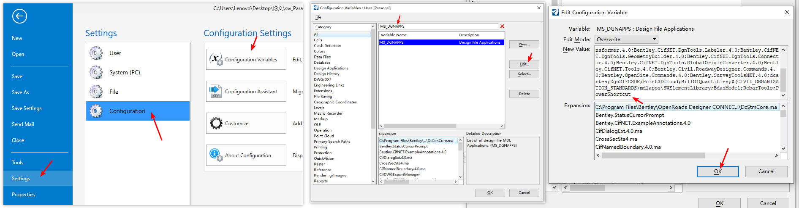
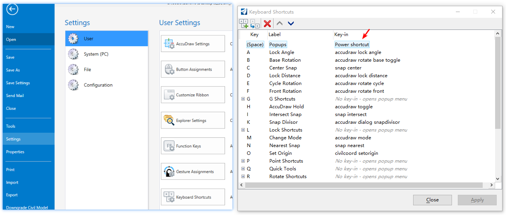

# MS超级快捷键功能使用说明

## 安装

1. 将编译的 `PowerShortcut.dll` 拷贝至 `C:\Program Files\Bentley\OpenRoads Designer CONNECT Edition\OpenRoadsDesigner\Mdlapps` 目录中。
2. 在 `C:\Users\%username%\AppData\Local\Bentley\OpenRoadsDesigner\10.0.0` 中建立 `shortcutsConfig.json` 文本文件（可以直接复制路径到资源管理器中打开）。然后将下面的模板复制到这个配置文件中。

## 快捷键定义

模板：

``` json
{
    "shortcuts":[
        {
            "names":["l"],
            "keyin":"place smartline",
            "description":"绘制直线"
        },
		{
            "names":["d","delete"],
            "keyin":"delete element",
            "description":"删除元素"
        },
		{
            "names":["arc"],
            "keyin":"place arc",
            "description":"绘制圆弧"
        },
		{
            "names":["reload"],
            "keyin":"power reloadConfig",
            "description":"重新加载快捷键"
        },
		{
            "names":["default"],
            "keyin":"model active default",
            "description":"打开 default model"
        },
		{
            "names":["model"],
            "keyin":"MDL KEYIN MODELMANAGER MODEL DIALOG TOGGLE",
            "description":"打开 model 管理界面"
        },
		{
            "names":["ref"],
            "keyin":"MDL KEYIN REF DIALOG REFERENCE TOGGLE",
            "description":"打开 model 管理界面"
        },
		{
            "names":["skp"],
            "keyin":"snap keypoint",
            "description":"捕捉关键点"
        },
    ]
}
```

快捷键定义：

``` json
{
    "names":["d","delete"], // 可以设置多个快捷键
    "keyin":"delete element", // 快捷键对应的 keyin 命令
    "description":"删除元素" // 快捷键的描述
}, // 每一个定义都要以英文逗号结尾
```

## 自动加载模块设置

Settings=>Configuration=>Configuration Variables，搜索 MS_DGNAPPS，点击修改，在内容末尾添加 `;PowerShortcut`，点击确定。



## 修改空格唤醒快捷键

Settings=>User=>Keyboard Shortcuts, 修改空格（space）的 keyin 为：`Power shortcut` 。



